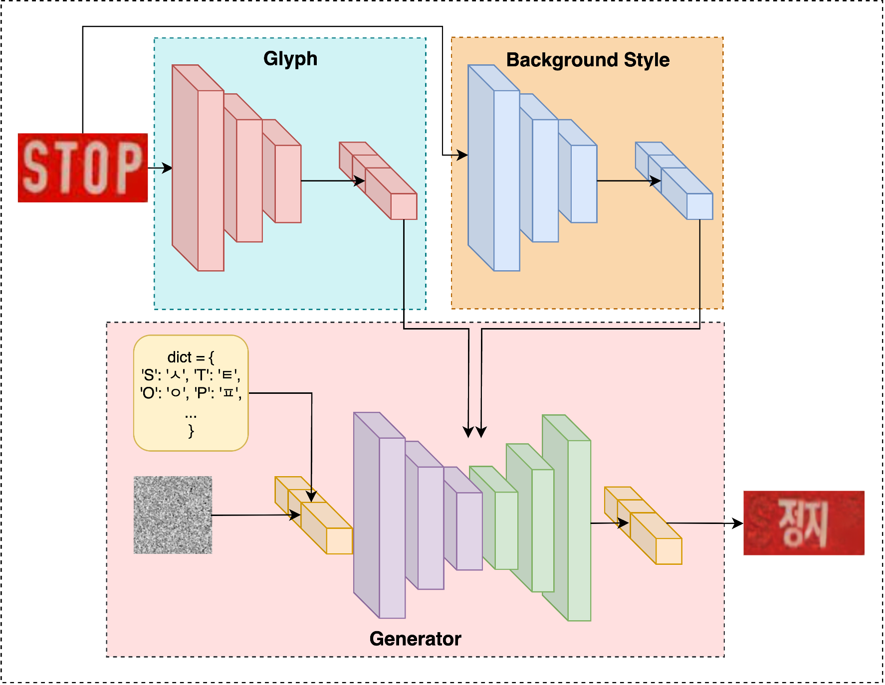
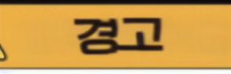
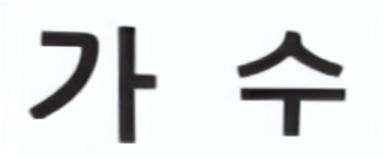

<h1 align="center"> <em>TextCtrl-Translate: Extending TextCtrl 

with TOSPI and Multilingual Support </em></h1>

<p align="center">
<a href='https://arxiv.org/abs/2410.10133'></a> 
<a href='https://github.com/weichaozeng/TextCtrl'></a>
</p>

<!-- TOSPI로 변경 -->
<p align="center">
  
</p>

### About
This repository is based on **TextCtrl** [[Zeng et al., 2024]](https://arxiv.org/abs/2410.10133).  
We extend the original framework with:
- **TOSPI** (Text Object Shape Powered Inference)  
- **Multilingual Training**: enabling text editing and translation from other languages **into Korean**.  

### Differences from the original
- Original TextCtrl focused on Japanese text editing.  
- Our extension introduces **cross-lingual capabilities**: currently supports **other languages → Korean** text translation/editing.  
- Compatible with the original checkpoints while supporting **new translation tasks**.  


## 1 Installation

- python = 3.11.13
- torch = 2.5.1+cu124
- cuda = 12.4
  - used for train : NVIDIA RTX A5000 24GB * 4
  - used for inference : NVIDIA RTX A5000 24GB * 1

### 1.1 Code Preparation 
```bash
# Clone the repo
$ git clone https://github.com/PNU-CSE-Graduation-TMOJI/TextCtrl-Translate.git
$ cd TextCtrl-Translate/
# Install required packages
$ conda create --name tospi python=3.11 -y
$ conda activate tospi
$ pip install -r requirement.txt
```
### 1.2 Checkpoints Preparation
Download the checkpoints from  
- [Link_1](https://drive.google.com/drive/folders/1OMgXXIXi-VN2hTlPywtdzIW5AJMIHzF0?usp=drive_link) (project-provided custom weights: style encoder, VGG19, monitor, etc.)  
- [Link_2](https://huggingface.co/stable-diffusion-v1-5/stable-diffusion-v1-5) (pretrained Stable Diffusion v1.5: UNet, VAE, scheduler)  
- [Link_3](https://huggingface.co/ea3124/tospi/tree/main) (text/ocr-related weights: style encoder, text encoder, TrOCR, tmp checkpoint)  

The file structure should be set as follows:
```bash
TextCtrl-Translate/
├── weights
│   ├── model.pth                             # weight of style encoder and unet [Link_1]
│   ├── sd                                    # pretrained weight of stable-diffusion-v1-5 [Link_2]
│   │   ├── scheduler
│   │   ├── unet
│   │   └── vae
│   ├── style_encoder.ckpt                    # pretrained style encoder [Link_3]
│   ├── text_encoder.ckpt                     # pretrained glyph encoder [Link_3]
│   ├── trocr-ko                              # OCR weight [Link_3]
│   │   ├── config.json
│   │   └── trocr_model.bin                   
│   ├── vgg19.pth                             # VGG19 feature extractor [Link_1]
│   ├── vision_model.pth                      # monitor model [Link_1]
│   └── vitstr_base_patch16_224.pth           # ViTSTR model [Link_1]
├── ...
├── tmp
│   └── model69.pt                            # tmp checkpoint [Link_3]
```

## 2 Inference
### 2.1 Data Preparation
The file structure of inference data should be set as the *example/*:  
```bash
TextCtrl/
├── example/
│   ├── i_s/                # source cropped text images
│   ├── i_s.txt             # filename and text label of source images in i_s/
│   └── i_t.txt             # filename and text label of target images
```

### 2.2 Edit Arguments
Edit the arguments in *inference.py*, especially:
```bash
parser.add_argument("--ckpt_path", type=str, default="tmp/model69.pth")
parser.add_argument("--dataset_dir", type=str, default="example/")
parser.add_argument("--output_dir", type=str, default="example_result/")
```


### 2.3 Generate Images
The inference result could be found in *example_result/* after:
```bash
$ PYTHONPATH=.../TextCtrl-Translate/ python inference.py
```

### 2.4 Inference Results
| Source Images | Target Text | Infer Results |
| ---           |    :---:    |           --- |
|   |   *"정지"*   |       |
|   |   *"경고"*     |       |
|   |   *"서행"*   |       |
|   |   *"가수"*    |       |


## 3 Training
### 3.1 Data Preparation
The training relies on synthetic data generated by 
[SRNet-Datagen_kr](https://github.com/PNU-CSE-Graduation-TMOJI/SRNet-Datagen_kr).
```bash
Syn_data/
├── fonts/
│   ├── arial.ttf/              
│   └── .../  
├── train/
│   ├── train-50k-1/                    
│   ├── train-50k-2/            
│   ├── train-50k-3/              
│   └── train-50k-4/                     
│       ├── i_s/
│       ├── mask_s/
│       ├── i_s.txt
│       ├── t_f/
│       ├── mask_t/
│       ├── i_t.txt
│       ├── t_t/
│       ├── t_b/
│       └── font.txt/ 
└── eval/
    └── eval-1k/

```
### 3.2 Text Style Pretraining
```bash
$ cd prestyle/
# Modify the path of dir in the config file
$ cd configs/
$ vi StyleTrain.yaml
# Start pretraining
$ cd ..
$ python train.py
```

### 3.3 Text Glyph Pretraining
```bash
$ cd preglyph/
# Modify the path of dir in the config file
$ cd configs/
$ vi GlyphTrain.yaml
# Start pretraining
$ cd ..
$ python pretrain.py
```

### 3.4 Prior Guided Training
```bash
$ cd TextCtrl/
# Modify the path of dir in the config file
$ cd configs/
$ vi train.yaml
# Start pretraining
$ cd ..
$ python train.py
```


<!-- ## 4 Evaluation
### 4.1 Data Preparation
Download the ScenePair dataset from [Link](https://drive.google.com/file/d/1m_o2R2kFj_hDXJP5K21aC7lKs-eUky9s/view?usp=sharing) and unzip the files. The structure of each folder is as follows:  
```bash
├── ScenePair/
│   ├── i_s/                # source cropped text images
│   ├── t_f/                # target cropped text images
│   ├── i_full/             # full-size images
│   ├── i_s.txt             # filename and text label of images in i_s/
│   ├── i_t.txt             # filename and text label of images in t_f/
│   ├── i_s_full.txt        # filename, text label, corresponding full-size image name and location information of images in i_s/
│   └── i_t_full.txt        # filename, text label, corresponding full-size image name and location information of images in t_f/
``` -->
<!-- ### 4.2 Generate Images
Before evaluation, corresponding edited images should be generated for a certain method based on the ScenePair dataset and should be saved in a *'.../result_folder/'* with the same filename. Result of some methods on ScenePair dataset are provided [here](https://drive.google.com/file/d/1343td96X7SuE0hYsMbTHALFmr1Md7SnQ/view?usp=drive_link).

### 4.3 Style Fidelity
SSIM, PSNR, MSE and FID are uesd to evaluate the style fidelity of edited result, with reference to [qqqyd/MOSTEL](https://github.com/qqqyd/MOSTEL).
```bash
$ cd evaluation/
$ python evaluation.py --target_path .../result_folder/ --gt_path .../ScenePair/t_f/
```

### 4.4 Text Accuracy
ACC and NED are used to evaluate the text accuracy of edited result, with the offical code and checkpoint in [clovaai/deep-text-recognition-benchmark](https://github.com/clovaai/deep-text-recognition-benchmark).   -->

## Related Resources
Our work is built upon and inspired by the following projects:

- [ko_trocr](https://github.com/ddobokki/ko_trocr)
- [PNU-CSE-Graduation-TMOJI/ko_trocr_tr](https://github.com/PNU-CSE-Graduation-TMOJI/ko_trocr_tr)
- [youdao-ai/SRNet-Datagen](https://github.com/youdao-ai/SRNet-Datagen)
- [PNU-CSE-Graduation-TMOJI/SRNet-Datagen_kr](https://github.com/PNU-CSE-Graduation-TMOJI/SRNet-Datagen_kr)
- [weichaozeng/TextCtrl](https://github.com/weichaozeng/TextCtrl)